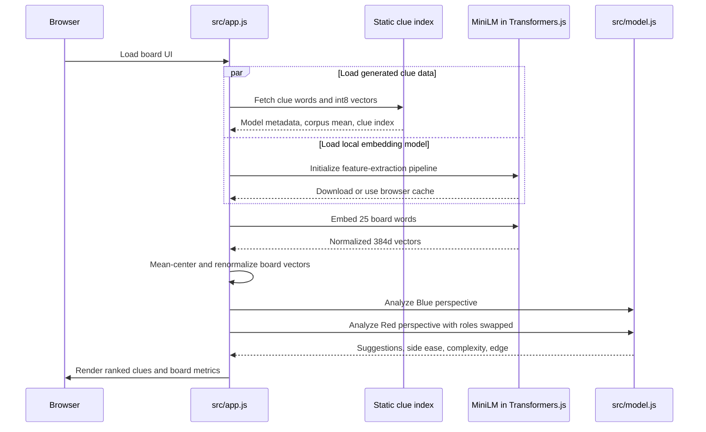
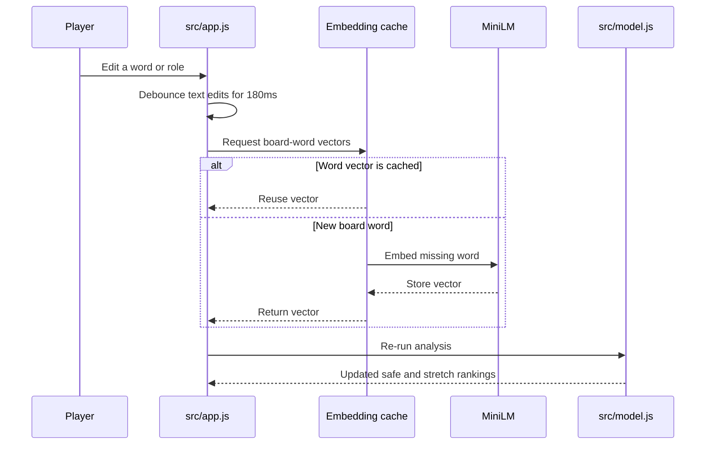
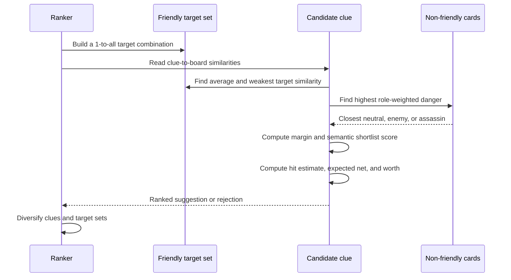

# Codenames Trainer

A local-first Codenames clue trainer. It embeds the board, searches a 3,000-word clue index by default, and ranks clue options for every possible target count. A built-in model picker compares larger vocabularies and alternative embeddings.

[Open the live trainer](https://codenames.andybergon.me)

## TLDR

- **Embedding:** `Xenova/all-MiniLM-L6-v2`, run locally in the browser with Transformers.js.
- **Clue set:** 30,000 frequent English words from `wordfreq` 3.1.1, filtered through WordNet and a legality filter; the fastest 3,000-word prefix remains the default.
- **Fast search:** clue embeddings are precomputed, mean-centered, normalized, and stored as an int8 static index. Only the 25 board words are embedded at runtime.
- **Negative scoring:** the weakest target similarity must beat the highest role-weighted neutral, enemy, or assassin similarity.
- **Outputs:** one collapsible, sortable recommendation table with per-target-count availability, a 1-to-9 target range, and a minimum Worth filter; defaults are 2-4 targets, Worth 50, and a compact view. Advanced reveals Net, Margin, and Fit/cohesion diagnostics.
- **Board metrics:** a symmetric difficulty score and Blue-vs-Red edge computed by scoring both team perspectives.
- **Board words:** generated boards default to the 400-word original English base-game set; Extended doubles the pool to 800 with mathematically ranked, reviewed additions.
- **Gameplay:** switch recommendations between Blue and Red, then click a recommendation to mark its targets guessed and pass the turn automatically.
- **Guessed cards:** guessed cards flip in place and are excluded from role counts, scoring, clue legality, and later recommendations; each card can be restored individually.
- **Theme:** follow the system appearance or persist an explicit light or dark mode.
- **Shareable boards:** versioned `?b=` links reproduce words, roles, word set, the stable random layout, and the selected layout mode; generated boards use short seeds while edited boards fall back to compact explicit payloads.

The model download happens on first use and is then cached by the browser. Board words are processed locally and are not sent to an application server.

Turn progress is session-local. Reloading a shared board restores its words, roles, and layout without guessed-card or active-turn state.

## Run

```sh
npm install
npm run dev
```

The Vite dev server accepts explicit host and port arguments:

```sh
npm run dev -- --host 127.0.0.1 --port 3535
```

## Check

```sh
npm run check
```

The smoke test uses a checked-in sample-board embedding fixture, so normal checks do not redownload the model.

Responsive browser regressions run separately:

```sh
npm run test:ui
```

Run both the static/smoke checks and responsive browser suite with `npm test`.

Refresh the controlled Model picker speed comparison with `npm run benchmark:picker`. It excludes loading, runs every model/vocabulary combination in one Node process, and records warmups, repeated samples, medians, spread, and machine metadata in `scripts/generated/model-picker-benchmark.json`.

## Board Word Sets

**Official** is the default for generated boards and contains 400 unique words from the original English base game, including the printed multi-word entries `ICE CREAM`, `LOCH NESS`, `NEW YORK`, and `SCUBA DIVER`. The list is based on a [public transcription of the original set](https://gist.github.com/siemanko/6cc17ee2a253089969b1b904660b4097), with obvious spelling transcription errors normalized.

**Extended** is a strict 800-word superset: Official plus 400 trainer additions. Its generator starts from a reviewed universe of concrete, imageable, culturally broad, and playful words. It then uses the same MiniLM embedding space to score frequency, association breadth, semantic-domain entropy, and category fit; selects across 14 domains; and rejects overly similar choices within each domain. The reviewed candidate universe is an intentional safety and fun guardrail: mathematical breadth alone can otherwise over-rank generic administrative nouns.

Regenerate the checked-in set and its audit report with:

```sh
npm run generate:extended
```

The output is deterministic for the checked-in clue index and candidate universe. The report at `scripts/generated/extended-word-report.json` records the formula, counts, category distribution, aggregate scores, and selected words for review.

New v3 share links encode the selected word set and support the larger pool. Existing v1 links continue to use the historical 366-word pool, and v2 links continue to use the former Official 400 / Extended 407 pools, so previously shared seeded and edited boards remain reproducible.

## Embedding Pipeline

`all-MiniLM-L6-v2` produces 384-dimensional vectors. The generator computes the mean vector over the entire clue corpus, subtracts it from every clue vector, and normalizes the result. Runtime board embeddings receive the same transform. Mean-centering removes much of the shared single-word cosine baseline that otherwise makes generic clues appear close to unrelated cards.

The default remains MiniLM-L6 with 3,000 candidates. The Model picker below the recommendations replaces the old static model summary and compares every combination of MiniLM-L3, MiniLM-L6, BGE-small, MiniLM-L12, and MPNet-base with 3k, 10k, and 30k candidate vocabularies. Its speed cells show controlled median Node scoring time rather than noisy browser-local measurements. A model and its compatible static index load only after selection. Indexes are split into 0-3k, 3k-10k, and 10k-30k int8 shards under `public/data/model-lab/`, so moving upward downloads only the additional candidate tiers. Board words remain fully dynamic.

## Human Gameplay Embedding Evaluation

`npm run evaluate:embeddings` compares browser-compatible q8 embedding models against two public human datasets:

- [Cultural Codes](https://github.com/SALT-NLP/codenames): 7,703 Codenames Duet turns with human clues, guesses, intended targets, neutral words, and avoid words.
- [Lexical Search and Pragmatics in Connector](https://github.com/hawkrobe/lexical-search-and-pragmatics): 2,250 human production clues for fixed two-word targets on full 20-word boards.

The benchmark pins both upstream commits, downloads their files into the gitignored cache, and does not redistribute the datasets because neither upstream repository contains an explicit license file. It embeds each human clue and board, applies the trainer's clue-corpus mean-centering, then measures agreement with human guesses, target recovery, and avoid-word errors. The checked-in report is `scripts/generated/embedding-model-comparison.json`.

Centered-model results from the July 2026 run, refreshed with the same 30,000-clue centering corpus used by Model picker:

| Model | q8 model | Duet first guess | Duet target recall | Duet avoid rate | Two-target recall | Exact target pair |
| --- | ---: | ---: | ---: | ---: | ---: | ---: |
| MiniLM-L3 | **17.5 MB** | 49.60% | 56.09% | 10.37% | 50.31% | 20.84% |
| **MiniLM-L6 (current)** | 23 MB | 51.27% | 57.43% | **9.44%** | 50.11% | 22.67% |
| MiniLM-L12 | 34 MB | 51.70% | 57.84% | 10.09% | **54.22%** | **28.27%** |
| **BGE-small** | 34 MB | **52.04%** | **58.57%** | 9.46% | 52.49% | 23.64% |
| MPNet-base | 110 MB | 49.61% | 55.85% | 10.62% | 50.93% | 22.44% |

BGE-small has the best played-turn target recall: versus the current model it gains 0.77 percentage points on first-guess agreement and 1.14 points on Duet target recall, with an avoid rate within 0.02 points. MiniLM-L12 is substantially better at recovering intended pairs, but its higher avoid rate makes it a riskier default. The wider endpoints show that size alone does not help: MiniLM-L3 saves 5.5 MB but loses 1.34 recall points, while 110 MB MPNet-base loses 1.58 recall points and raises avoid errors. A production switch still needs an end-to-end comparison of the trainer's generated top clues because this benchmark isolates the embedding layer and does not test the clue vocabulary, legality filter, or Worth formula.

## Candidate Vocabulary Evaluation

`npm run evaluate:candidates` measures whether the generated vocabulary contains the human clue, using 7,703 Cultural Codes observations and 2,250 Connector observations. After removing blank/non-letter clues, 9,932 observations remain. This is a real coverage metric, but it is deliberately shown separately from quality: containing a human clue does not mean the trainer ranks it highly or that it is legal on every board.

| Candidates | Human clue coverage | Incremental index download per model |
| ---: | ---: | ---: |
| 3,000 | 61.79% | about 1.5 MB |
| 10,000 | 85.08% | about 3.5 MB more |
| 30,000 | 93.47% | about 10 MB more |

The reproducible coverage report is `scripts/generated/candidate-coverage.json`. The separate controlled speed report is `scripts/generated/model-picker-benchmark.json`; its values are comparable within the recorded machine and process, not universal timings for every device.

## Clue Vocabulary

The generated vocabulary starts from the 50,000 most frequent English entries exposed by [`wordfreq`](https://pypi.org/project/wordfreq/). The generator keeps 30,000 single ASCII words that:

- contain 3-18 letters;
- are recognized as content words by [WordNet](https://wordnet.princeton.edu/);
- are not common function words or explicitly blocked terms.

The existing curated `CLUE_BANK` is appended when a seed is not already present. At runtime, candidates are dynamically removed when they equal, stem-match, or substantially contain a remaining board word. The displayed candidate count therefore changes with the board and guessed cards; there is no additional fixed runtime exclusion. This is a practical legality filter, not a complete implementation of table-specific Codenames rulings.

To regenerate the vocabulary and embeddings:

```sh
python3 -m venv .venv
source .venv/bin/activate
pip install -r scripts/requirements-clues.txt
npm run generate:data
```

## Negative Scoring

For every candidate clue and target set:

```text
target floor = minimum cosine similarity to any intended friendly word

neutral danger  = similarity
enemy danger    = similarity + 0.08 * max(0, similarity) + 0.015
assassin danger = similarity + 0.22 * max(0, similarity) + 0.065

margin = target floor - maximum danger
```

This applies role cost after semantic similarity. It does not subtract an enemy vector from a target vector. An enemy must be farther from the clue than a neutral card to produce the same margin, and the assassin receives the largest penalty.

The estimated hit rate is a sigmoid over margin, weakest-target similarity, target cohesion, and target count. Expected net is:

```text
expected net = target count * estimated hit - miss cost * (1 - estimated hit)
```

Miss costs are `0.9` for neutral, `1.8` for enemy, and `5.5` for assassin. Worth combines expected net, semantic fit, cohesion, margin, consistency, and clue familiarity into a 0-99 display score.

The hit rate and worth score are ranking heuristics, not calibrated probabilities. The serious next quality step is to record actual guesses and fit these coefficients against gameplay outcomes.

## Board Metrics

The trainer scores the board from both perspectives. The Red pass reuses the same board embeddings and clue index, but swaps Blue and Red roles so both teams receive identical scoring treatment.

Each side receives a 0-100 ease score:

```text
side ease = 65% * average Worth of best 3 safe clues
          + 20% * average Worth of best 3 stretch clues
          + 15% * safe-option breadth
```

Four safe options earns full breadth credit. Board complexity is `100 - average(Blue ease, Red ease)`: 0-32 is Easy, 33-65 Moderate, and 66-100 Hard. Blue vs Red is `Blue ease - Red ease`; differences within 3 points are displayed as Even.

## Architecture Alternatives

| Approach | Strength | Cost / limitation |
| --- | --- | --- |
| **Current: local MiniLM + static clue index** | Private, keyless, dynamic board words, fast repeated scoring | First model load; fixed generated clue vocabulary |
| Embed every clue in the browser | No generated index and fully dynamic vocabulary | Slow first run and much more client compute |
| Local Python service with Sentence Transformers + FAISS | Easy model swaps, large vocabularies, efficient nearest-neighbor search | Requires a persistent backend and Python model runtime |
| Hosted embedding API | Small frontend and easy model upgrades | Requires a backend, API key, recurring cost, and remote board processing |
| Static fastText or GloVe word vectors | Very fast lexical similarity and fully offline runtime | Large assets; weaker phrase/context handling |
| Embedding shortlist + learned reranker | Best route to game-specific quality | Needs labeled Codenames guesses, evaluation data, and more inference |

For this trainer, the current hybrid is the strongest first default. A local service becomes attractive once the clue vocabulary grows beyond tens of thousands. A hosted API is attractive when operational simplicity matters more than local-only processing.

## Sequence Diagrams

### Initial Analysis



### Editing a Board Card



### Scoring a Target Set


