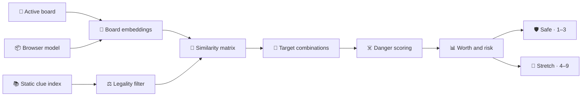

# 🧠 Clue engine

Back to [README](../README.md).

- 🧠 **Default model** · MiniLM-L6 · 384 dimensions · browser-local inference
- 📚 **Default vocabulary** · 10,000 frequency-ranked and filtered clues
- 📦 **Index** · mean-centered, normalized, int8 static vectors
- 🎯 **Runtime work** · embed active board words · score precomputed clue candidates
- 🛡️ **Outputs** · safe one-to-three target lane · stretch four-to-nine target lane
- 🔒 **Network boundary** · static assets download to the browser · board words stay local

## 🔁 Pipeline

Arrows show the data-processing order for one board analysis.



The runtime embeds only active board words. Guessed cards are excluded from embeddings, candidate legality, role counts, target combinations, and later recommendations.

## ⚖️ Candidate legality

A candidate clue is removed when it:

- Equals a remaining board word after normalization.
- Stem-matches a remaining board word.
- Contains or is contained by a recognized compound from the trainer word set.
- Has substantial five-character-or-longer containment with a board word.

The filter is deterministic and practical, but it does not replace table-specific spymaster rulings.

## ☠️ Danger policy

For cosine similarity `s`:

| ☠️ Role | ⚖️ Weighted danger |
|---|---|
| ⚪ Neutral | `s` |
| 🔴 Enemy | `s + 0.08 × max(0, s) + 0.015` |
| ⚫ Assassin | `s + 0.22 × max(0, s) + 0.065` |

The closest weighted non-friendly card defines candidate danger.

```text
target floor = weakest intended-target similarity
margin       = target floor - closest weighted danger
```

Candidates whose weakest target similarity is below `0.04` are removed before full scoring.

## 📊 Ranking contract

The success estimate combines margin, weakest-target similarity, target cohesion, target count, and additional assassin pressure. It is a ranking heuristic, not a calibrated probability.

```text
expected net = target count × success - miss cost × (1 - success)
```

| ☠️ Closest danger | 💸 Miss cost |
|---|---:|
| ⚪ Neutral | `0.9` |
| 🔴 Enemy | `1.8` |
| ⚫ Assassin | `5.5` |

Worth is a `0–99` score combining expected net, margin, centroid fit, weakest-target similarity, cohesion, consistency, and clue familiarity. Final ordering also rewards larger useful target sets and safe classifications before diversifying repeated clues and target combinations.

## 🛣️ Output lanes

Every accepted target must have similarity of at least `0.13`.

| 🛣️ Lane | 🔢 Targets | 📐 Margin | 📊 Success | 💰 Expected net |
|---|---:|---:|---:|---:|
| 🛡️ Safe | `1–3` | `≥ 0.045` | `≥ 0.58` | Any |
| 🚀 Stretch | `4–9` | `≥ -0.28` | `≥ 0.28` | `≥ 0.35` |

Risk labels are separate from lane eligibility:

- 🟢 **Safe** · at most three targets · margin `≥ 0.11` · success `≥ 0.73`
- 🔴 **Risky** · assassin is closest, margin `< 0.025`, or success `< 0.56`
- 🟡 **Medium** · between the safe and risky boundaries

## 🎴 Board metrics

The engine scores Blue and Red independently by swapping friendly and enemy roles while reusing the same embeddings and clue index.

```text
side ease = 65% × average Worth of best three safe clues
          + 20% × average Worth of best three stretch clues
          + 15% × safe-option breadth

complexity = 100 - average(Blue ease, Red ease)
edge       = Blue ease - Red ease
```

Four safe options provide full breadth credit. Edge values within three points are displayed as even.

## 📦 Model and index assets

| 📦 Asset | 🎯 Role | 📍 Source |
|---|---|---|
| 🧠 Model | Embed board words | Browser model cache |
| 📚 Clue words | Candidate vocabulary | [`scripts/generated/clue-words.json`](../scripts/generated/clue-words.json) |
| 📐 Int8 vectors | Precomputed clue embeddings | `public/data/model-lab/` |
| 🎯 Corpus mean | Center board and clue vectors | Model manifest |
| 📊 Frequencies | Reward familiar clues | Generated clue metadata |

Selectable indexes use incremental `0–3k`, `3k–10k`, `10k–30k`, and `30k–100k` shards. Every shard for a model uses the same 30,000-clue centering corpus, including the experimental 100k tail. Moving upward downloads only the additional candidate tiers.

The picker exposes MiniLM-L3, MiniLM-L6, and BGE-small because each offers a distinct size, speed, or quality tradeoff. A model and compatible index load only after selection.

## 🧪 Evaluation

| 🧪 Command | 🎯 Output | 📌 Verifies |
|---|---|---|
| ✅ `npm run check` | Smoke result + build | Both output lanes |
| 🧠 `npm run evaluate:embeddings` | [`embedding-model-comparison.json`](../scripts/generated/embedding-model-comparison.json) | Human target/avoid fit |
| 📚 `npm run evaluate:candidates` | [`candidate-coverage.json`](../scripts/generated/candidate-coverage.json) | Human clue coverage |
| ⏱️ `npm run benchmark:picker` | [`model-picker-benchmark.json`](../scripts/generated/model-picker-benchmark.json) | Controlled scoring cost |
| 🏗️ `npm run generate:data` | Words + model shards | Generated asset parity |

Embedding evaluation uses the pinned Cultural Codes and Connector datasets without redistributing their unlicensed source files. Treat embedding-layer recall as one input, not proof that the complete generated ranking is better.

## 🧩 Source map

- [`src/model.js`](../src/model.js) · legality, similarity, scoring, lanes, risk, and board metrics
- [`src/embeddings.js`](../src/embeddings.js) · browser embedding pipeline and vector transforms
- [`src/clue-index.js`](../src/clue-index.js) · manifest and incremental shard loading
- [`src/model-lab.js`](../src/model-lab.js) · model-picker configurations and measurements
- [`src/app.js`](../src/app.js) · board lifecycle, team perspectives, and rendered recommendations
