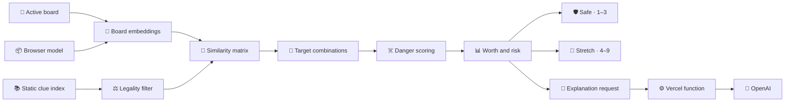

# 🧠 Clue engine

Back to [README](../README.md).

- 🧠 **Train default** · MiniLM-L6 · 384 dimensions · browser-local inference
- 🇮🇹 **Italian beta** · Train + Play · Multilingual E5 small · English remains default
- 🤖 **Play spymaster default** · BGE-small · hybrid scoring · ten-point multi-clue tolerance
- 📚 **Default vocabulary** · 10,000 frequency-ranked and filtered clues
- 📦 **Index** · mean-centered, normalized, int8 static vectors
- 🎯 **Runtime work** · embed active board words · score precomputed clue candidates
- 🛡️ **Outputs** · safe one-to-three target lane · stretch four-to-nine target lane
- 🔒 **Network boundary** · scoring and roles stay local · semantic explanations send only the clue and selected words

## 🔁 Pipeline

Arrows show the data-processing order for one board analysis.



The runtime embeds only active board words. Guessed cards are excluded from embeddings, candidate legality, role counts, target combinations, and later recommendations.

## ⚖️ Candidate legality

A candidate clue is removed when it:

- Equals a remaining board word after normalization.
- Stem-matches a remaining board word.
- Is a conservative plural, past-tense, or participle inflection of a remaining board word, or vice versa.
- Contains or is contained by recognized compound components.

The morphology filter uses explicit English suffix transformations rather than generic substring matching, so pairs such as `life` / `lives`, `story` / `stories`, `run` / `running`, and agent-noun derivations such as `teach` / `teacher` are rejected without treating unrelated pairs such as `plane` / `planet` as equivalent. Ranked Train and Play suggestions, benchmark fallback clues, and manually entered Play clues share this legality rule. The filter is deterministic and practical, but it does not replace table-specific spymaster rulings.

Normalization preserves Unicode letters and accents. Italian legality also folds accents for comparison, applies Italian number, gender, and verb-family stems, covers checked irregular pairs, and rejects stem containment such as `abbraccia` against `braccio`. The filter is deterministic and conservative, but it does not replace table-specific spymaster rulings or native review.

## ☠️ Danger policy

For cosine similarity `s`:

| ☠️ Role | ⚖️ Weighted danger |
|---|---|
| ⚪ Neutral | `s` |
| 🔴 Enemy | `s + 0.08 × max(0, s) + 0.015` |
| ⚫ Assassin | `s + 0.22 × max(0, s) + 0.065` |

The closest weighted non-friendly card defines candidate danger.

```text
target floor = weakest intended-target similarity
margin       = target floor - closest weighted danger
```

Candidates whose weakest target similarity is below `0.04` are removed before full scoring.

## 📊 Ranking contract

The success estimate combines margin, weakest-target similarity, target cohesion, target count, and additional assassin pressure. It is a ranking heuristic, not a calibrated probability.

```text
expected net = target count × success - miss cost × (1 - success)
```

| ☠️ Closest danger | 💸 Miss cost |
|---|---:|
| ⚪ Neutral | `0.9` |
| 🔴 Enemy | `1.8` |
| ⚫ Assassin | `5.5` |

Worth is a `0–99` score combining expected net, margin, centroid fit, weakest-target similarity, cohesion, consistency, and clue familiarity. Final ordering also rewards larger useful target sets and safe classifications before diversifying repeated clues and target combinations.

## 💬 Semantic explanations

Train makes no hosted request while rendering recommendations. Selecting **Explain** sends only that clue, its intended targets, and the active English or Italian language through [`api/explain-recommendations.js`](../api/explain-recommendations.js), and GPT-5.4 nano returns one semantic sentence in that language. In completed Play reviews, selecting a full clue or guess row is a free local action that reveals one paid **Explain** action on that row. Clue selections group their `For` target words, while a guess request contains the clue and that one guessed word. Developer-only live analysis exposes the same interaction before completion. The browser caches successful results per language for the tab, so revisiting the same clue-word combination does not create another paid request.

The prompt is owned by [`server/recommendation-explanation-prompt.js`](../server/recommendation-explanation-prompt.js):

```text
You explain why Codenames target words fit a proposed clue.

Goal:
- Write one natural sentence for each recommendation.
- When the exact clue supports the relationships, begin with "These words connect through [short shared concept]:".
- After the colon, give every target its own short clause explaining the relationship.

Constraints:
- Use common, broadly accepted meanings only.
- Mention every target exactly once.
- Do not group multiple targets into one clause, even when their relationships are similar.
- Treat each clue as an immutable game token. Repeat its exact spelling in the explanation, allowing only capitalization changes.
- Never spell-correct, normalize, inflect, translate, or substitute the clue with another word, including a near neighbor.
- If the exact clue does not support the requested relationships, say that no reliable explanation was found for that exact clue. Do not explain a different token.
- Write clue and target words in ordinary sentence case except where preserving the clue's spelling requires otherwise.
- Do not mention scores, embeddings, safety, danger words, guessing, or strategy.
- Do not invent a relationship when the connection is weak. State the weaker association plainly.
- Keep each explanation between 12 and 36 words.
- Return only schema-valid JSON.
```

Only the clue and selected intended-target or guessed words cross the application boundary. The full board, roles, scores, outcomes, and closest danger stay in the browser. The server validates bounded inputs, fixes the model and prompt, requests strict structured output, and keeps `OPENAI_API_KEY` server-side. It also requires the returned sentence to contain the exact clue spelling and rejects undeclared one-edit near neighbors. A response that changes or omits the clue becomes a localized no-reliable-explanation fallback before it reaches the browser cache.

The risk sentence follows the scoring contract:

- An assassin is always the main risk.
- A non-positive margin says the danger matches at least as strongly as the weakest target.
- A positive margin below the `0.11` safe threshold says the danger sits close behind the weakest target.
- A margin of at least `0.11` says the closest danger remains clearly behind every target.

The default table shows the explicit **Explain** action followed by the local risk sentence. After a successful request, the generated sentence replaces the action. **Score details** reveals Worth, expected net, estimated hit, closest-danger similarity, margin, fit, and cohesion.

Completed Play games relabel the game log as **Post-game analysis** and expose explanations only after a clue or guess row is selected. The action is absent during ordinary active play, and Play does not construct its request until the completed game has already revealed those targets and the player explicitly selects **Explain**.

## 🛣️ Output lanes

Every accepted target must have similarity of at least `0.13`.

| 🛣️ Lane | 🔢 Targets | 📐 Margin | 📊 Success | 💰 Expected net |
|---|---:|---:|---:|---:|
| 🛡️ Safe | `1–3` | `≥ 0.045` | `≥ 0.58` | Any |
| 🚀 Stretch | `4–9` | `≥ -0.28` | `≥ 0.28` | `≥ 0.35` |

Risk labels are separate from lane eligibility:

- 🟢 **Safe** · at most three targets · margin `≥ 0.11` · success `≥ 0.73`
- 🔴 **Risky** · assassin is closest, margin `< 0.025`, or success `< 0.56`
- 🟡 **Medium** · between the safe and risky boundaries

## 🎴 Board metrics

The engine scores Blue and Red independently by swapping friendly and enemy roles while reusing the same embeddings and clue index.

```text
side ease = 65% × average Worth of best three safe clues
          + 20% × average Worth of best three stretch clues
          + 15% × safe-option breadth

complexity = 100 - average(Blue ease, Red ease)
edge       = Blue ease - Red ease
```

Four safe options provide full breadth credit. Edge values within three points are displayed as even.

## 🧠 Owner concept reranker experiment

The checked [Owner concept reranker smoke](evaluations/owner-clue-ranking/README.md) is evaluation-only. It keeps the legal 30,000-clue vocabulary and direct number-one ranking, then retrieves at most 64 low-direct multi-clue candidates with WordNet definitions. Each activated clue scores every active friendly, enemy, neutral, and assassin card through the same guarded association formula used by the operative bridge. The existing target, weighted-danger, Worth, and Play policy stages consume those complete rows without special treatment for friendly cards.

Across 200 deterministic opening-side cases, the bounded reranker changed 18 selected clues. Exploratory semantic triage rated 11 changes poor, including `FLOCK 2 -> CIRCLE / GRASS`, `ABSTRACTION 2 -> TEACHER / FORK`, and `PEACE 3 -> FAIR / COLD / LIFE`. Five appeared plausible and two were mixed. This is a gross-failure screen rather than independent human evidence, and the current variant is not eligible for human or cross-model promotion.

The likely failure mode is independent per-card sense maximization: each target can receive its highest score through a different meaning of the clue, while a human clue must express one coherent meaning across the full target set. The next local candidate must enforce one shared clue sense before any human calibration. The forced `JOUST -> medieval tournament -> MATCH / CROWN / GLOVE / BELT` fixture still passes using the checked precomputed vector, but JOUST remains outside the production 30,000-clue prefix.

The experiment reuses local BGE and WordNet assets and makes no hosted request. Missing definitions, inactive candidates, incomplete card rows, and unsupported configurations keep exact direct scores. The current evaluator is intentionally unoptimized: its warm median phases total about `1.85 s`, including `717 ms` for candidate retrieval and `104 ms` for concept preparation. No Play setting, saved-game field, benchmark fingerprint, or production behavior enables this path.

## 🕵️ Play missed-target policy

The bot spymaster reconstructs unresolved intended targets from its own prior `clue-given` events. A target remains missed only while that friendly card is unrevealed. The policy adjusts recommendation scores without changing clue legality, target membership, or the information available to the operative.

- 🌱 **Late** is the default. Each missed target in a candidate loses six points for every never-targeted friendly card beyond the final one. The penalty reaches zero when only one fresh target remains.
- ⚖️ **Mid-game** applies three penalty points for every fresh target beyond the final three. It starts mixing old and new targets earlier.
- 🔁 **Immediately** applies no missed-target penalty, so the normal clue score can retry an unresolved target on the next turn.

The penalty is applied before the multi-card tolerance comparison. `npm run benchmark:play` uses the same policy and accepts `--missed-target-timing late|balanced|immediate`.

Clue reuse is a three-way Play setting. **Never repeat in this game** is the default and excludes every clue previously given by the same team. **Block the team's previous clue** excludes only that team's immediately preceding clue. **Allow repeats** applies no history exclusion. The other team's clue history never counts, and a replacement clue may target any overlap with earlier intended cards. Live Play excludes the configured history from the full candidate analysis, with defensive filtering during ranking. Benchmarks apply the same rule to analysis, ranking, and fallback selection through `--clue-repeat-policy allow|previous|never`.

In the checked 100-board default run, 106 Hybrid clue turns had an unresolved prior target. Late recovery retried one on 37.7% of those eligible turns overall, but on 0 of 20 turns where at least four never-targeted friendly cards remained. The same run kept 0 wrong-team hits per game, a 0% assassin rate, 1.68 correct cards per turn, and 9.36 turns per game.

## 🔎 Play operative policy

The bot operative starts with centered clue-to-unrevealed-word cosine similarities. The Concept bridges setting is On by default and can be switched Off for direct-only ranking. When it is On, BGE-small English multi-card clues use a guarded local concept bridge only when the strongest direct card similarity is below `0.20`. The bridge embeds separate Princeton WordNet sense definitions for the clue and each public board word, finds the strongest sense-to-sense relationship, and ranks with:

```text
association score = max(direct similarity, concept similarity - 0.05)
```

Turning Concept bridges Off, single-card clues, stronger direct matches, non-BGE models, and Italian games keep exact cosine ordering. Missing concept data, unsupported terms, or concept-load failures also fall back to direct ordering. The browser lazily loads one compact board dictionary and one of 256 deterministic FNV-1a hash shards for the clue. Hash sharding keeps requests balanced across the vocabulary without changing lookup semantics. It uses the already selected local BGE model, makes no paid request, and sends no clue or board data to a hosted service.

The sense strings are generated data, not clue-specific rules written by hand. `npm run generate:concepts` parses a SHA-256-pinned Princeton WordNet 3.0 archive and writes the definitions under `public/data/concepts/`. Strings are retained because the selected local model embeds each relevant sense at runtime, which keeps the bridge inspectable, deterministic, offline, and aligned with the active BGE model. Precomputed BGE sense vectors would produce identical scores and only trade runtime work for a larger model-coupled asset, so they are not a distinct quality candidate.

BGE is a bi-encoder, so it embeds the clue and each card independently and compares their pooled vectors. Its hidden layers contextualize one input at a time. They do not jointly inspect a clue-card pair, select separate word senses, or traverse an intermediate concept. Cosine similarity is also not transitive, so two terms can both be close to “medieval tournament” without being close to each other. A cross-encoder could reason over each clue-card pair, but it would require separate inference for every card and a model trained for that pairwise task. The guarded WordNet step instead makes the intermediate senses explicit and bounded while reusing the local BGE geometry.

When a completed turn is selected, Turn analysis lists the strongest WordNet sense pair for up to six highest-ranked cards whose bridge score actually raised operative ranking, plus a count of any lower-ranked bridges. Direct-only cards are omitted. Developer-game diagnostics retain the same bounded, optional public-information provenance for live analysis.

The activation rule resolves the preserved regression: `JOUST → medieval tournament → MATCH / CROWN / GLOVE / BELT`, where direct BGE similarity put `PIANO` first. The selected BGE fixture ranks `MATCH`, `BELT`, `CROWN`, and `GLOVE` before `PIANO`. The order among those four associations is not a claim about a single human ranking.

| 🔗 Approach | 📌 Verdict | 🎯 JOUST | 👥 Cultural recall | 📦 Cache | 🧠 Peak RAM |
|---|---|---|---:|---:|---:|
| 📖 BGE WordNet | 🟢 Keep | ✅ Passes | `59.16%` | Existing | Existing |
| 🥖 Mixedbread xsmall | 🔴 Reject | ✅ Passes | `53.15%` | `95.9 MB` | `547 MB` |
| 🔀 MiniLM MS MARCO | 🔴 Reject | ❌ Fails | `48.39%` | `47.7 MB` | `105 MB` |
| 🅱️ BGE v2-m3 | 🔴 Reject | ❌ Fails | `53.17%`* | `587.8 MB` | `1.82 GB` |
| 🅱️ BGE base | 🔴 Reject | ❌ Fails | `41.04%`* | `296.4 MB` | `1.04 GB` |
| 🌍 GTE multilingual | 🔴 Reject | ❌ Fails | Fixed screen | `340.9 MB` | Not gated |
| 📋 Jina v3 listwise | 🚫 License | ✅ Passes | Fixed screen | `1.22 GB` | Not gated |
| ☁️ GPT-5.4 nano | 🚫 Hosted | ✅ Passes | Fixed screen | Network | Network |

`*` BGE base and BGE v2-m3 use the same deterministic one-in-eight human sample after failing direct JOUST. They are compared only with the WordNet baseline on that sample, not with full-dataset percentages.

The latent walk searched the top 64 local clue-vocabulary concepts and used the strongest positive two-edge cosine product. It still left `PIANO` ahead of `GLOVE`, `MATCH`, and `BELT`. The local sweep then tested MiniLM MS MARCO, Mixedbread xsmall v1, BGE reranker base, and BGE reranker v2-m3 on direct pairs and after the production WordNet bridge. The [supplemental fixed screen](evaluations/operative-ranking/reranker-supplemental-screen.json) adds GTE multilingual and instructed Jina v3 listwise with every WordNet definition appended.

Mixedbread is the only production-eligible direct reranker that puts all four JOUST targets above `PIANO`. It also recovers all five original two-card fixtures except `SEANCE`, but its full human target recall remains below WordNet on Cultural Codes (`53.15%` versus `59.16%`) and Connector (`50.53%` versus `53.76%`). The bounded pipeline first applies the production BGE activation and WordNet expansion, then gives the top eight candidates a normalized cross-encoder adjustment. No tested local reranker makes WordNet unnecessary.

The capped [hosted listwise comparison](evaluations/operative-ranking/hosted-listwise-reranker-evaluation.json) used two GPT-5.4 nano requests over six original public fixtures. Preflight projected at most `$0.0026`, the hard cap was `$0.005`, and measured cost was `$0.0008`. Direct and WordNet-expanded prompts both recovered every fixed target. Hosted ranking remains comparison-only because automatic turns must work offline with bounded latency and no per-turn spend. Cohere v4 Fast and Pro were not called because no Cohere credential is configured.

The broader representation screen also rejected a runtime replacement. AutoExtend has no ready BGE-small-aligned artifact and would need retraining from the chosen input vector space. LMMS uses a separate transformer sense space and adds a second large model. ARES is CC BY-NC-SA 4.0. ConceptNet Numberbatch is CC BY-SA 4.0 and its prior standalone Codenames run failed Fun and transfer gates. None supplied stronger eligible evidence than the generated WordNet glosses.

The deterministic evaluation includes five original fixed candidate boards that use only the checked WordNet definitions and Codenames word bank. Human dataset records remain in the gitignored cache; the checked report retains only aggregate alignment metrics.

| 🧩 Clue | 📐 Direct top | 🔗 Guarded top | 🎯 Measured gain |
|---|---|---|---|
| 📜 PALEOGRAPHY 2 | TEETH, SHAKESPEARE | JOURNAL, PAPER | 0/2 to 2/2 |
| 🛡️ HERALDRY 2 | SORCERER, SIEGE | EAGLE, CROWN | 0/2 to 2/2 |
| 👻 SPECTER 2 | MIRROR, RADAR | GHOST, SHADOW | 0/2 to 2/2 |
| 🎭 THESPIAN 2 | AGENT, SURGEON | PLAY, ACTOR | 0/2 to 2/2 |
| 🔮 SEANCE 2 | SCORPION, UNDERTAKER | GHOST, SPIRIT | 0/2 to 2/2 |

The generated senses connect paleography to written records, heraldry to armorial emblems, specter to ghostly perceptions, thespian to theatrical performance, and seance to incorporeal spirits. The complete original fixtures and scores live in [`concept-ranking-evaluation.json`](evaluations/operative-ranking/concept-ranking-evaluation.json).

Guess variation defaults Off, so candidates retain their association-score order. Standard adds a reproducible adjustment in the range `-0.0275` to `+0.0275` and can reorder candidates whose scores are within `0.055`. Neither mode changes passing thresholds. The operative receives only the public clue, public card words, public remaining-agent counts, and local sense definitions. It never receives hidden roles, intended target IDs, spymaster danger metrics, or the full recommendation analysis.

| 🔎 Mode | 🎯 First minimum | 🧩 Later minimum | ↔️ Separation | 🏁 Public score |
|---|---:|---:|---:|---|
| 🛡️ Conservative | `0.10` | `0.32` | Strict | Ignored |
| ⚖️ Dynamic | `0.07` to `0.12` | `0.09` to `0.30` | Adaptive | Used |
| 🚀 Aggressive | `0.055` | `0.09` | Permissive | Ignored |

Conservative keeps the first guess permissive enough for games to progress, then requires much stronger evidence before filling the second or later slot of a multi-card clue. Aggressive preserves the former production thresholds.

Dynamic uses only facts visible to an operative: guesses already made, the declared clue number, and both teams' remaining-agent counts. A trailing team accumulates comeback pressure from its deficit and from the opponent approaching four remaining agents. The first guess retains the middle threshold. Follow-up thresholds continuously interpolate toward Aggressive, reaching full pressure at a three-agent deficit while at least two declared guesses remain. The policy halves that pressure for the final declared slot and bonus guesses so a comeback push does not automatically fill every clue slot. It keeps the dedicated possible-win thresholds, raises thresholds with a comfortable lead, and never applies comeback pressure while tied or ahead. The separate Extra guess setting still decides whether any number-plus-one guess is available.

`npm run benchmark:play` matches the guarded concept-ranking and no-variation production defaults. Pass `--operative-ranking direct` to isolate the former direct-only behavior or `--operative-noise standard` to compare the historical seeded adjustment.

The checked 100-board same-model run measures deterministic production regression and game shape:

| 🔎 Mode | 🧩 Low-sim fill | 🛑 Early pass | ✅ Correct per turn | 🔴 Wrong per game | ☠️ Assassin | ⏱️ Turns |
|---|---:|---:|---:|---:|---:|---:|
| ⚖️ Dynamic | 2.0% | 3.1% | 1.68 | 0.00 | 0.0% | 9.36 |
| 🛡️ Conservative | 0.0% | 20.5% | 1.30 | 0.00 | 0.0% | 11.81 |
| 🚀 Aggressive | 4.7% | 0.0% | 1.76 | 0.00 | 0.0% | 8.92 |

The [MiniLM-L6 operative stress run](../scripts/generated/play-operative-aggression-cross-model.md) holds BGE-small spymaster clues fixed while changing the guesser's embedding geometry:

| 🔎 Mode | 🧩 Low-sim fill | 🛑 Early pass | ✅ Correct per turn | 🔴 Wrong per game | ☠️ Assassin | ⏱️ Turns |
|---|---:|---:|---:|---:|---:|---:|
| ⚖️ Dynamic | 12.8% | 24.2% | 1.00 | 0.45 | 9.0% | 14.17 |
| 🛡️ Conservative | 10.8% | 29.6% | 0.93 | 0.44 | 7.0% | 15.36 |
| 🚀 Aggressive | 42.8% | 2.2% | 1.24 | 0.96 | 14.0% | 10.71 |

Low-sim fill means a guess that reaches the declared clue number has centered similarity below `0.25`. This is an explicit diagnostic threshold, not a human semantic judgment. Same-model self-play overstates agreement, and cross-model transfer is a stress test rather than evidence of human guessing behavior. Human-realism claims require recorded human choices or Play telemetry.

The checked concept evaluation keeps the existing human metrics separate from the fixed JOUST regression. On all 7,703 Cultural Codes turns, guarded BGE first-guess accuracy moves from `52.31%` to `52.46%`, target recall from `58.99%` to `59.16%`, exact target sets from `53.03%` to `53.06%`, and avoid-word rate stays at `9.45%`. On all 2,250 Connector turns, target recall moves from `52.91%` to `53.76%`. A deterministic quarter-sample with MiniLM-L6 also improves first-guess accuracy, target recall, exact target sets, and pairwise target accuracy without increasing its avoid-word rate.

MiniLM scores all `107,624` unique clue-card pairs and fails every human gate. Cultural Codes target recall falls to `48.39%`, exact target sets to `42.48%`, and avoid-word rate rises to `11.93%`; Connector target recall falls to `44.58%`. Its strongest `0.04` bounded bridge-rerank pipeline reaches `59.21%` Cultural Codes target recall, `53.19%` exact target sets, and `9.39%` avoid-word rate. Connector pairwise target accuracy declines from `82.86%` to `82.80%`.

Mixedbread also scores the complete human set. Its direct Cultural Codes target recall is `53.15%`, exact target sets are `47.32%`, and avoid-word rate is `10.44%`; Connector target recall is `50.53%`. Its `0.04` WordNet pipeline reaches `59.13%` Cultural Codes target recall, `53.10%` exact target sets, and `9.45%` avoid-word rate. Connector target recall reaches `53.96%` and exact target sets reach `25.69%`, while pairwise target accuracy moves slightly down from the WordNet baseline of `82.86%` to `82.82%`. These changes remain small and mixed.

The paired [100-board BGE full-game comparison](evaluations/operative-ranking/concept-ranking-full-game-comparison.json) at 10,000 candidates produced identical decisions and aggregate outcomes for direct and guarded ranking: `1.561049` correct cards per turn, zero wrong-team, neutral, assassin, fallback, or stall events, and `9.91` turns per game. The controlled guarded benchmark took `98.6s` instead of `95.4s`, an observed increment of about `32ms` per simulated game on the recorded machine. The current focused warm BGE measurement adds a median `115ms` for 101 definition texts across a 25-card board. A separate [20-board comparison at the current 30,000-candidate default](evaluations/operative-ranking/concept-ranking-30k-smoke-comparison.json) also produced zero paired deltas across every gameplay and safety metric. These are broad safety regressions, not evidence that the bridge never affects a real weak clue.

The expanded local sweep measures cached assets and isolated resident peaks for each compatible ONNX model. MiniLM uses `47.7 MB` and about `105 MB`; Mixedbread uses `95.9 MB` and about `547 MB`; BGE base uses `296.4 MB` and about `1.04 GB`; BGE v2-m3 uses `587.8 MB` and about `1.81 GB`. Warm direct 25-card scoring takes `4.0ms`, `19.1ms`, `17.6ms`, and `52.0ms`, respectively. Their eight-item WordNet shortlists take `5.5ms`, `20.6ms`, `52.7ms`, and `157.0ms`, in addition to the existing `115ms` median WordNet embedding work.

The original [MiniLM 20-board comparison](evaluations/operative-ranking/bridge-reranker-full-game-comparison.json) and the [Mixedbread 20-board comparison](evaluations/operative-ranking/mixedbread-bridge-reranker-full-game-comparison.json) both produce zero paired deltas against WordNet. Mixedbread retains identical `1.642105` correct cards per turn, zero wrong-team, neutral, assassin, fallback, or stall events, and `9.5` turns per game. It clears safety non-inferiority but shows no correct-card superiority.

An [unrestricted MiniLM operative experiment](evaluations/operative-ranking/concept-ranking-unrestricted-cross-model-comparison.json) increased correct cards per turn by `0.079` but also increased wrong-team hits by `0.57` per game, neutral hits by `0.49`, and assassin rate by `0.06`. It failed all three transfer safety gates. Production therefore enables the bridge only for BGE-small and preserves direct ranking for every other operative model. The final [100-board guarded cross-model comparison](evaluations/operative-ranking/concept-ranking-cross-model-comparison.json) confirms that requesting concept ranking with a MiniLM operative produces the exact direct baseline. The [20-board guarded reranker transfer check](evaluations/operative-ranking/bridge-reranker-cross-model-comparison.json) also produces zero paired deltas across correct cards, wrong-team hits, neutral hits, assassin rate, fallbacks, stalls, and turns because unsupported operative geometries fail closed to direct ranking.

The WordNet runtime bridge remains required. Mixedbread proves that a direct reranker can repair JOUST, but it does not match WordNet across the full human datasets. Every bounded local pipeline still starts with WordNet, and none improves the full-game result. Jina and GPT-5.4 nano show that instructed listwise ranking is promising on six fixed boards, but licensing and the offline automatic-turn boundary block them. The mixed human changes, zero full-game benefit, and large download and memory additions prevent promotion. Production behavior remains unchanged.

## 📦 Model and index assets

| 📦 Asset | 🎯 Role | 📍 Source |
|---|---|---|
| 🧠 Model | Embed board words | Browser model cache |
| 📚 Clue words | Candidate vocabulary | [`scripts/generated/clue-words.json`](../scripts/generated/clue-words.json) |
| 📐 Int8 vectors | Precomputed clue embeddings | `public/data/model-lab/` |
| 🔗 Sense definitions | Guarded operative bridges | `public/data/concepts/` |
| 🎯 Corpus mean | Center board and clue vectors | Model manifest |
| 📊 Frequencies | Reward familiar clues | Generated clue metadata |

Selectable indexes use incremental `0–3k`, `3k–10k`, `10k–30k`, and `30k–100k` shards. Every shard for a model uses the same 30,000-clue centering corpus, including the experimental 100k tail. Moving upward downloads only the additional candidate tiers.

The picker exposes MiniLM-L3, MiniLM-L6, and BGE-small because each offers a distinct size, speed, or quality tradeoff. A model and compatible index load only after selection.

Local model initialization and clue-index JSON requests are single-flight per configuration or URL. An actual transient rejection receives at most three total attempts with short bounded backoff and jitter. Rejected promises are removed before another attempt, while HTTP 4xx responses other than 408 and 429, corrupt JSON or index data, incompatible dimensions, validation failures, and unsupported configurations fail without retrying. Slow unresolved loads never start a parallel initialization.

Italian assets live under `public/data/model-lab/it/multilingual-e5-small/`. The 3k and 10k tiers use the same mean over 30,000 Italian candidates. The manifest pins `it:extended-v1`, the Leipzig archive checksum and CC BY 4.0 attribution, the E5 repository revision and model checksum, Unicode filters, the `query: ` task prefix, and every shard byte count. English assets retain their existing paths and cache keys.

The Italian board pool is original project data in [`scripts/italian/extended-words.txt`](../scripts/italian/extended-words.txt). It is intentionally independent from the official Italian game list. `npm run generate:italian` verifies exactly 800 unique single-word entries, downloads or reuses the pinned Leipzig archive, prioritizes the authored pool as game-friendly clue seeds, rebuilds the 30,000-word center, and writes both selectable shards.

Generated Italian clues also receive a pairwise `0.23` similarity penalty for long clue and board-word pairs with high whole-word and consonant-skeleton Jaro-Winkler similarity plus a shared prefix or suffix. This guard suppresses the fixed `MONOLOGO → MONGOLFIERA` and `PARTONO → PANTERA + BURATTINO` spelling artifacts without changing manual clue legality, operative guesses, or English scoring. `npm run evaluate:italian` covers the three rejected fixtures and six allowed controls. Any threshold change must also refresh both Italian full-game benchmarks.

## 🧪 Evaluation

| 🧪 Command | 🎯 Output | 📌 Verifies |
|---|---|---|
| ✅ `npm run check` | Smoke result + build | Both output lanes |
| 🧠 `npm run evaluate:embeddings` | [`embedding-model-comparison.json`](../scripts/generated/embedding-model-comparison.json) | Human target/avoid fit |
| 🔗 `npm run evaluate:concept-ranking` | [`concept-ranking-evaluation.json`](evaluations/operative-ranking/concept-ranking-evaluation.json) | Multi-reranker JOUST, human, latency, and memory gates |
| 🧠 `npm run evaluate:owner-concepts` | [`owner-concept-reranker-smoke.json`](evaluations/owner-clue-ranking/owner-concept-reranker-smoke.json) | Bounded Owner clue concept reranking |
| 🧪 Fixed local screen | [`reranker-supplemental-screen.json`](evaluations/operative-ranking/reranker-supplemental-screen.json) | GTE and Jina direct versus WordNet fixtures |
| ☁️ `npm run evaluate:hosted-reranker` | [`hosted-listwise-reranker-evaluation.json`](evaluations/operative-ranking/hosted-listwise-reranker-evaluation.json) | Capped hosted direct versus WordNet fixtures |
| 🎮 `npm run benchmark:compare` | [`mixedbread-bridge-reranker-full-game-comparison.json`](evaluations/operative-ranking/mixedbread-bridge-reranker-full-game-comparison.json) | Strongest eligible reranker full-game effects |
| 🛡️ `npm run benchmark:compare` | [`bridge-reranker-cross-model-comparison.json`](evaluations/operative-ranking/bridge-reranker-cross-model-comparison.json) | Guarded transfer fallback |
| 👥 `npm run summarize:human-data` | [`human-data-embedding-comparison.json`](../scripts/generated/human-data-embedding-comparison.json) | Local and hosted human alignment |
| 🧪 `npm run benchmark:compare` | [`play-model-comparison-v3.json`](../scripts/generated/play-model-comparison-v3.json) | Canonical baseline and candidate scorecard |
| 📚 `npm run evaluate:candidates` | [`candidate-coverage.json`](../scripts/generated/candidate-coverage.json) | Human clue coverage |
| 💬 `npm run evaluate:explanations -- --max-cost-usd 0.08` | [`recommendation-explanation-evaluation.json`](../scripts/generated/recommendation-explanation-evaluation.json) | Plain-language explanation quality and model cost |
| ⏱️ `npm run benchmark:picker` | [`model-picker-benchmark.json`](../scripts/generated/model-picker-benchmark.json) | Controlled scoring cost |
| 🎮 `npm run benchmark:play` | [`play-policy-benchmark.md`](../scripts/generated/play-policy-benchmark.md) | Full-game clue and operative policy |
| 🔗 `npm run benchmark:compare` | [`concept-ranking-full-game-comparison.json`](evaluations/operative-ranking/concept-ranking-full-game-comparison.json) | Concept full-game effects |
| 🔬 `npm run benchmark:compare` | [`concept-ranking-30k-smoke-comparison.json`](evaluations/operative-ranking/concept-ranking-30k-smoke-comparison.json) | Current-default smoke comparison |
| 🛡️ `npm run benchmark:compare` | [`concept-ranking-cross-model-comparison.json`](evaluations/operative-ranking/concept-ranking-cross-model-comparison.json) | Guarded cross-model fallback |
| 📊 `npm run benchmark:compare` | Comparison JSON + Markdown | Paired bootstrap, configuration fingerprints, and verdict |
| 📐 `npm run benchmark:calibrate-similarity` | Calibration JSON | Comparable score geometry |
| 👥 `npm run calibration:build` | Calibration round JSON | Blinded human tasks |
| 🧾 `npm run calibration:evaluate` | Human result JSON | Exported answer scoring |
| 🇮🇹 `npm run benchmark:play:italian` | [`italian-play-policy-benchmark.md`](../scripts/generated/italian-play-policy-benchmark.md) | Italian same-model games |
| 🔀 `npm run benchmark:play:italian-transfer` | [`italian-play-minilm-transfer-benchmark.md`](../scripts/generated/italian-play-minilm-transfer-benchmark.md) | Italian transfer stress |
| 🔢 `npm run analyze:play-clues` | [`play-clue-bias-analysis.json`](../scripts/generated/play-clue-bias-analysis.json) | Opening-board clue depth |
| 🌐 `npm run experiment:api-index` | Gitignored API index | Cost-capped hosted model |
| 👥 `npm run evaluate:api-embeddings` | [`api-embedding-comparison.json`](../scripts/generated/api-embedding-comparison.json) | Hosted human fit |
| 🏗️ `npm run generate:data` | Words + model shards | Generated asset parity |
| 🔗 `npm run generate:concepts` | WordNet concept shards | Relation-data parity |
| 🇮🇹 `npm run generate:italian` | Italian pool + E5 shards | Pinned language assets |
| 🔤 `npm run evaluate:italian` | [`italian-embedding-feasibility.json`](../scripts/generated/italian-embedding-feasibility.json) | Semantics + morphology |

Embedding evaluation combines four pinned sources: Cultural Codes, Connector, Strategy and Structure, and the English CodeNamesAgent co-occurrence experiment. Together they provide 7,625 Cultural Codes guess turns, 2,250 Connector target tasks, 6,336 Strategy and Structure human responses, and 443 co-occurrence responses. Metrics remain source-specific because the board shapes and game incentives differ.

Raw snapshots live in the private `codenames-calibration-data` Vercel Blob store in `dub1`. The loader checks the gitignored local cache first, then authenticated private Blob, then the pinned upstream source. Blob access uses `BLOB_READ_WRITE_TOKEN`; no raw dataset is shipped to the browser or committed to git because the upstream repositories do not declare explicit dataset licenses.

The expanded comparison is checked in [`human-data-embedding-comparison.json`](../scripts/generated/human-data-embedding-comparison.json). Treat embedding-layer recall and human guess agreement as inputs, not proof that the complete generated ranking is better. Full-game cross-model transfer remains the promotion gate.

The hidden `?mode=benchmarks` page presents one row per complete checked configuration. It consumes the canonical v3 benchmark comparison artifact described in [Benchmark reporting](benchmark-reporting.md). The comparator owns scores, deltas, intervals, gates, verdicts, provenance, and source-separated human evidence. The page filters, sorts, applies display weights only when explicitly labelled, and renders the existing report values.

The full-game benchmark has frozen smoke, calibration, development, and test board ranges. Use `--comparison-only` for embedding selection, then compare full reports with `npm run benchmark:compare`. Candidate models must first match BGE-small's fixed similarity-probe mean and spread through `--similarity-scale` and `--similarity-offset`. This makes the configured multi-clue tolerance and absolute operative thresholds comparable across models. Every new result contains the complete canonical behavior configuration, exact asset hashes, a stable configuration fingerprint, and compact derived labels.

The hidden `?mode=calibrate` page loads versioned rounds from `public/data/calibration/manifest.json`. It automatically stores each guess, rating, and note under `codenames-human-calibration-v1`, while an empty pass requires the explicit Record pass action. When `DATABASE_URL` and `CALIBRATION_SYNC_SECRET` are configured, `/api/calibration` also stores each answer in `codenames_calibration_answers` and restores the newest event by timestamp. Clears and invalidated task definitions create timestamped deletion records, so stale browsers and imports cannot resurrect answers. The client retries transient failures with bounded exponential backoff and accepts the database record on a stale-write conflict. Production exchanges the pairing key once for a strict HTTP-only cookie and never stores it in browser-readable storage. Vite bypasses pairing only when the request socket is loopback and uses the server-side `DATABASE_URL` directly. Browser persistence and JSON import/export remain available when database sync is unavailable.

Public calibration rounds never contain model labels, intended targets, or team roles. Those fields stay in `scripts/generated/calibration-answer-keys/` and are joined only by `npm run calibration:evaluate -- --answer-key <key.json>`. Use the first 30-task round once as a gross-failure calibration baseline. Add later rounds only when new evidence is needed.

The locked selection contract is `scripts/generated/embedding-finalist-protocol.json`. Cross-model transfer is the primary development gate, while same-model self-play is a regression and efficacy screen. Held-out test runs require the protocol path, an eligible model entry, and a new output path.

Hosted challengers stay out of the browser and production bundle until they pass the same promotion gates. `npm run experiment:api-index -- --max-cost-usd 0.03` builds a batch-cached OpenAI index after a cost preflight, checks billed usage after each request, and keeps every vector under `.cache`. `npm run evaluate:api-embeddings` reuses that cache for the human datasets. Supply the key through `OPENAI_API_KEY`; neither command writes it to disk.

The explanation evaluation compares GPT-5 nano, GPT-5.4 nano, and GPT-5.6 Luna across eight varied target combinations. GPT-5.6 Sol judges semantic accuracy, target coverage, specificity, clarity, and concision with randomized candidate labels. With the explicit clause-per-target prompt, Luna scored `5.00/5`, GPT-5.4 nano scored `4.85/5`, and GPT-5 nano scored `4.78/5`. The production gate chooses the cheapest model scoring at least `4.8/5`, so GPT-5.4 nano wins. The estimated generation cost is `$0.745` per 1,000 fifteen-recommendation batches, and the successful evaluation billed about `$0.032`.

The first 1,024-dimensional `text-embedding-3-large` experiment improved human clue recovery but failed default-policy fun and cross-model transfer safety, so BGE-small remains the production choice. See [Play fun optimization](play-fun-optimization.md) for the compact result and promotion workflow.

## 🧩 Source map

- [`src/model.js`](../src/model.js) · legality, similarity, scoring, lanes, risk, and board metrics
- [`src/recommendation-explanation.js`](../src/recommendation-explanation.js) · local score summary and danger wording
- [`src/recommendation-explanation-client.js`](../src/recommendation-explanation-client.js) · bounded requests and tab cache
- [`src/recommendation-explanation-control.js`](../src/recommendation-explanation-control.js) · shared paid-action UI for Train and completed Play games
- [`server/recommendation-explanation-prompt.js`](../server/recommendation-explanation-prompt.js) · semantic prompt and output schema
- [`server/recommendation-explanation-service.js`](../server/recommendation-explanation-service.js) · validation and OpenAI request
- [`api/explain-recommendations.js`](../api/explain-recommendations.js) · Vercel function adapter
- [`src/embeddings.js`](../src/embeddings.js) · browser embedding pipeline and vector transforms
- [`src/clue-index.js`](../src/clue-index.js) · manifest and incremental shard loading
- [`src/load-retry.js`](../src/load-retry.js) · classified bounded retries and single-flight load caching
- [`src/model-lab.js`](../src/model-lab.js) · model-picker configurations and measurements
- [`src/locales.js`](../src/locales.js) · English and Italian Train and Play interface copy
- [`src/app.js`](../src/app.js) · board lifecycle, team perspectives, and rendered recommendations
- [`src/play/bots.js`](../src/play/bots.js) · Play clue selection and public-only operative guesses
- [`src/play/concept-data.js`](../src/play/concept-data.js) · lazy WordNet board and clue-shard loading
- [`src/play/concept-ranking.js`](../src/play/concept-ranking.js) · guarded sense-bridge scoring and direct fallback
- [`src/play/game-state.js`](../src/play/game-state.js) · Play rules, event history, public projection, and completed-turn replay
- [`src/play/mode.js`](../src/play/mode.js) · Play rendering, model orchestration, and completion-gated operative score review
- [`src/play/settings.js`](../src/play/settings.js) · validated Play bot defaults and overrides
