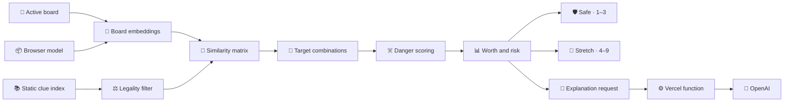

# 🧠 Clue engine

Back to [README](../README.md).

- 🧠 **Train default** · MiniLM-L6 · 384 dimensions · browser-local inference
- 🇮🇹 **Italian beta** · Train + Play · Multilingual E5 small · English remains default
- 🤖 **Play spymaster default** · BGE-small · hybrid scoring · five-point multi-clue tolerance
- 📚 **Default vocabulary** · 10,000 frequency-ranked and filtered clues
- 📦 **Index** · mean-centered, normalized, int8 static vectors
- 🎯 **Runtime work** · embed active board words · score precomputed clue candidates
- 🛡️ **Outputs** · safe one-to-three target lane · stretch four-to-nine target lane
- 🔒 **Network boundary** · scoring and roles stay local · semantic explanations send only clue and targets

## 🔁 Pipeline

Arrows show the data-processing order for one board analysis.



The runtime embeds only active board words. Guessed cards are excluded from embeddings, candidate legality, role counts, target combinations, and later recommendations.

## ⚖️ Candidate legality

A candidate clue is removed when it:

- Equals a remaining board word after normalization.
- Stem-matches a remaining board word.
- Is a conservative plural, past-tense, or participle inflection of a remaining board word, or vice versa.
- Contains or is contained by recognized compound components.

The morphology filter uses explicit English suffix transformations rather than generic substring matching, so pairs such as `life` / `lives`, `story` / `stories`, and `run` / `running` are rejected without treating unrelated pairs such as `plane` / `planet` as equivalent. Ranked Train and Play suggestions, benchmark fallback clues, and manually entered Play clues share this legality rule. The filter is deterministic and practical, but it does not replace table-specific spymaster rulings.

Normalization preserves Unicode letters and accents. Italian legality also folds accents for comparison, applies Italian number, gender, and verb-family stems, covers checked irregular pairs, and rejects stem containment such as `abbraccia` against `braccio`. The filter is deterministic and conservative, but it does not replace table-specific spymaster rulings or native review.

## ☠️ Danger policy

For cosine similarity `s`:

| ☠️ Role | ⚖️ Weighted danger |
|---|---|
| ⚪ Neutral | `s` |
| 🔴 Enemy | `s + 0.08 × max(0, s) + 0.015` |
| ⚫ Assassin | `s + 0.22 × max(0, s) + 0.065` |

The closest weighted non-friendly card defines candidate danger.

```text
target floor = weakest intended-target similarity
margin       = target floor - closest weighted danger
```

Candidates whose weakest target similarity is below `0.04` are removed before full scoring.

## 📊 Ranking contract

The success estimate combines margin, weakest-target similarity, target cohesion, target count, and additional assassin pressure. It is a ranking heuristic, not a calibrated probability.

```text
expected net = target count × success - miss cost × (1 - success)
```

| ☠️ Closest danger | 💸 Miss cost |
|---|---:|
| ⚪ Neutral | `0.9` |
| 🔴 Enemy | `1.8` |
| ⚫ Assassin | `5.5` |

Worth is a `0–99` score combining expected net, margin, centroid fit, weakest-target similarity, cohesion, consistency, and clue familiarity. Final ordering also rewards larger useful target sets and safe classifications before diversifying repeated clues and target combinations.

## 💬 Recommendation explanations

Train makes no hosted request while rendering recommendations. Selecting **Explain** sends only that clue, its intended targets, and the active English or Italian language through [`api/explain-recommendations.js`](../api/explain-recommendations.js), and GPT-5.4 nano returns one semantic sentence in that language. The browser caches successful results per language for the tab, so revisiting the same clue-target combination does not create another paid request.

The prompt is owned by [`server/recommendation-explanation-prompt.js`](../server/recommendation-explanation-prompt.js):

```text
You explain why Codenames target words fit a proposed clue.

Goal:
- Write one natural sentence for each recommendation.
- Begin with "These words connect through [short shared concept]:".
- After the colon, give every target its own short clause explaining the relationship.

Constraints:
- Use common, broadly accepted meanings only.
- Mention every target exactly once.
- Do not group multiple targets into one clause, even when their relationships are similar.
- Write clue and target words in ordinary sentence case.
- Do not mention scores, embeddings, safety, danger words, guessing, or strategy.
- Do not invent a relationship when the connection is weak. State the weaker association plainly.
- Keep each explanation between 12 and 36 words.
- Return only schema-valid JSON.
```

Only the clue and intended target words cross the application boundary. The full board, roles, scores, and closest danger stay in the browser. The server validates bounded inputs, fixes the model and prompt, requests strict structured output, and keeps `OPENAI_API_KEY` server-side.

The risk sentence follows the scoring contract:

- An assassin is always the main risk.
- A non-positive margin says the danger matches at least as strongly as the weakest target.
- A positive margin below the `0.11` safe threshold says the danger sits close behind the weakest target.
- A margin of at least `0.11` says the closest danger remains clearly behind every target.

The default table shows the explicit **Explain** action followed by the local risk sentence. After a successful request, the generated sentence replaces the action. **Score details** reveals Worth, expected net, estimated hit, closest-danger similarity, margin, fit, and cohesion.

Completed Play games relabel the game log as **Post-game analysis** and use the same action beside clues with recorded intended targets. The action is absent during active play, and Play does not construct its request until the completed game has already revealed those targets.

## 🛣️ Output lanes

Every accepted target must have similarity of at least `0.13`.

| 🛣️ Lane | 🔢 Targets | 📐 Margin | 📊 Success | 💰 Expected net |
|---|---:|---:|---:|---:|
| 🛡️ Safe | `1–3` | `≥ 0.045` | `≥ 0.58` | Any |
| 🚀 Stretch | `4–9` | `≥ -0.28` | `≥ 0.28` | `≥ 0.35` |

Risk labels are separate from lane eligibility:

- 🟢 **Safe** · at most three targets · margin `≥ 0.11` · success `≥ 0.73`
- 🔴 **Risky** · assassin is closest, margin `< 0.025`, or success `< 0.56`
- 🟡 **Medium** · between the safe and risky boundaries

## 🎴 Board metrics

The engine scores Blue and Red independently by swapping friendly and enemy roles while reusing the same embeddings and clue index.

```text
side ease = 65% × average Worth of best three safe clues
          + 20% × average Worth of best three stretch clues
          + 15% × safe-option breadth

complexity = 100 - average(Blue ease, Red ease)
edge       = Blue ease - Red ease
```

Four safe options provide full breadth credit. Edge values within three points are displayed as even.

## 🔎 Play operative policy

The bot operative ranks only centered clue-to-unrevealed-word cosine similarities, with deterministic noise in the range `-0.0275` to `+0.0275` to avoid identical play. It never receives hidden roles, intended target IDs, spymaster danger metrics, or the full recommendation analysis.

| 🔎 Mode | 🎯 First minimum | 🧩 Later minimum | ↔️ Separation | 🏁 Public score |
|---|---:|---:|---:|---|
| 🛡️ Conservative | `0.10` | `0.32` | Strict | Ignored |
| ⚖️ Dynamic | `0.07–0.12` | `0.16–0.30` | Adaptive | Used |
| 🚀 Aggressive | `0.055` | `0.09` | Permissive | Ignored |

Conservative keeps the first guess permissive enough for games to progress, then requires much stronger evidence before filling the second or later slot of a multi-card clue. Aggressive preserves the former production thresholds.

Dynamic uses only facts visible to an operative: guesses already made, the declared clue number, and both teams' remaining-agent counts. It lowers follow-up thresholds when the team can win within the current clue or trails an opponent with at most two agents left. It raises them with a comfortable lead and otherwise uses the middle thresholds. The separate Extra guess setting still decides whether any number-plus-one guess is available.

The checked 100-board same-model run measures deterministic production regression and game shape:

| 🔎 Mode | 🧩 Low-sim fill | 🛑 Early pass | ✅ Correct per turn | 🔴 Wrong per game | ☠️ Assassin | ⏱️ Turns |
|---|---:|---:|---:|---:|---:|---:|
| ⚖️ Dynamic | 1.1% | 4.4% | 1.48 | 0.00 | 0.0% | 10.43 |
| 🛡️ Conservative | 0.0% | 17.1% | 1.23 | 0.00 | 0.0% | 12.73 |
| 🚀 Aggressive | 3.9% | 0.0% | 1.58 | 0.00 | 0.0% | 9.85 |

The [MiniLM-L6 operative stress run](../scripts/generated/play-operative-aggression-cross-model.md) holds BGE-small spymaster clues fixed while changing the guesser's embedding geometry:

| 🔎 Mode | 🧩 Low-sim fill | 🛑 Early pass | ✅ Correct per turn | 🔴 Wrong per game | ☠️ Assassin | ⏱️ Turns |
|---|---:|---:|---:|---:|---:|---:|
| ⚖️ Dynamic | 12.7% | 26.3% | 0.96 | 0.46 | 9.0% | 14.34 |
| 🛡️ Conservative | 12.6% | 29.7% | 0.91 | 0.49 | 5.0% | 15.40 |
| 🚀 Aggressive | 42.3% | 1.7% | 1.28 | 0.85 | 9.0% | 10.59 |

Low-sim fill means a guess that reaches the declared clue number has centered similarity below `0.25`. This is an explicit diagnostic threshold, not a human semantic judgment. Same-model self-play overstates agreement, and cross-model transfer is a stress test rather than evidence of human guessing behavior. Human-realism claims require recorded human choices or Play telemetry.

## 📦 Model and index assets

| 📦 Asset | 🎯 Role | 📍 Source |
|---|---|---|
| 🧠 Model | Embed board words | Browser model cache |
| 📚 Clue words | Candidate vocabulary | [`scripts/generated/clue-words.json`](../scripts/generated/clue-words.json) |
| 📐 Int8 vectors | Precomputed clue embeddings | `public/data/model-lab/` |
| 🎯 Corpus mean | Center board and clue vectors | Model manifest |
| 📊 Frequencies | Reward familiar clues | Generated clue metadata |

Selectable indexes use incremental `0–3k`, `3k–10k`, `10k–30k`, and `30k–100k` shards. Every shard for a model uses the same 30,000-clue centering corpus, including the experimental 100k tail. Moving upward downloads only the additional candidate tiers.

The picker exposes MiniLM-L3, MiniLM-L6, and BGE-small because each offers a distinct size, speed, or quality tradeoff. A model and compatible index load only after selection.

Italian assets live under `public/data/model-lab/it/multilingual-e5-small/`. The 3k and 10k tiers use the same mean over 30,000 Italian candidates. The manifest pins `it:extended-v1`, the Leipzig archive checksum and CC BY 4.0 attribution, the E5 repository revision and model checksum, Unicode filters, the `query: ` task prefix, and every shard byte count. English assets retain their existing paths and cache keys.

The Italian board pool is original project data in [`scripts/italian/extended-words.txt`](../scripts/italian/extended-words.txt). It is intentionally independent from the official Italian game list. `npm run generate:italian` verifies exactly 800 unique single-word entries, downloads or reuses the pinned Leipzig archive, prioritizes the authored pool as game-friendly clue seeds, rebuilds the 30,000-word center, and writes both selectable shards.

Generated Italian clues also receive a pairwise `0.23` similarity penalty for long clue and board-word pairs with high whole-word and consonant-skeleton Jaro-Winkler similarity plus a shared prefix or suffix. This guard suppresses the fixed `MONOLOGO → MONGOLFIERA` and `PARTONO → PANTERA + BURATTINO` spelling artifacts without changing manual clue legality, operative guesses, or English scoring. `npm run evaluate:italian` covers the three rejected fixtures and six allowed controls. Any threshold change must also refresh both Italian full-game benchmarks.

## 🧪 Evaluation

| 🧪 Command | 🎯 Output | 📌 Verifies |
|---|---|---|
| ✅ `npm run check` | Smoke result + build | Both output lanes |
| 🧠 `npm run evaluate:embeddings` | [`embedding-model-comparison.json`](../scripts/generated/embedding-model-comparison.json) | Human target/avoid fit |
| 📚 `npm run evaluate:candidates` | [`candidate-coverage.json`](../scripts/generated/candidate-coverage.json) | Human clue coverage |
| 💬 `npm run evaluate:explanations -- --max-cost-usd 0.08` | [`recommendation-explanation-evaluation.json`](../scripts/generated/recommendation-explanation-evaluation.json) | Plain-language explanation quality and model cost |
| ⏱️ `npm run benchmark:picker` | [`model-picker-benchmark.json`](../scripts/generated/model-picker-benchmark.json) | Controlled scoring cost |
| 🎮 `npm run benchmark:play` | [`play-policy-benchmark.md`](../scripts/generated/play-policy-benchmark.md) | Full-game clue and operative policy |
| 📊 `npm run benchmark:compare` | Comparison JSON | Paired bootstrap and promotion gates |
| 📐 `npm run benchmark:calibrate-similarity` | Calibration JSON | Comparable score geometry |
| 👥 `npm run calibration:build` | Calibration round JSON | Blinded human tasks |
| 🧾 `npm run calibration:evaluate` | Human result JSON | Exported answer scoring |
| 🇮🇹 `npm run benchmark:play:italian` | [`italian-play-policy-benchmark.md`](../scripts/generated/italian-play-policy-benchmark.md) | Italian same-model games |
| 🔀 `npm run benchmark:play:italian-transfer` | [`italian-play-minilm-transfer-benchmark.md`](../scripts/generated/italian-play-minilm-transfer-benchmark.md) | Italian transfer stress |
| 🔢 `npm run analyze:play-clues` | [`play-clue-bias-analysis.json`](../scripts/generated/play-clue-bias-analysis.json) | Opening-board clue depth |
| 🌐 `npm run experiment:api-index` | Gitignored API index | Cost-capped hosted model |
| 👥 `npm run evaluate:api-embeddings` | [`api-embedding-comparison.json`](../scripts/generated/api-embedding-comparison.json) | Hosted human fit |
| 🏗️ `npm run generate:data` | Words + model shards | Generated asset parity |
| 🇮🇹 `npm run generate:italian` | Italian pool + E5 shards | Pinned language assets |
| 🔤 `npm run evaluate:italian` | [`italian-embedding-feasibility.json`](../scripts/generated/italian-embedding-feasibility.json) | Semantics + morphology |

Embedding evaluation uses the pinned Cultural Codes and Connector datasets without redistributing their unlicensed source files. Treat embedding-layer recall as one input, not proof that the complete generated ranking is better.

The full-game benchmark has frozen smoke, calibration, development, and test board ranges. Use `--comparison-only` for embedding selection, then compare full reports with `npm run benchmark:compare`. Candidate models must first match BGE-small's fixed similarity-probe mean and spread through `--similarity-scale` and `--similarity-offset`. This makes the five-point multi-clue tolerance and absolute operative thresholds comparable across models.

The hidden `?mode=calibrate` page loads versioned rounds from `public/data/calibration/manifest.json`. It automatically stores each guess, rating, and note under `codenames-human-calibration-v1`, while an empty pass requires the explicit Record pass action. When `DATABASE_URL` and `CALIBRATION_SYNC_SECRET` are configured, `/api/calibration` also stores each answer in `codenames_calibration_answers` and restores the newest event by timestamp. Clears and invalidated task definitions create timestamped deletion records, so stale browsers and imports cannot resurrect answers. The client retries transient failures with bounded exponential backoff and accepts the database record on a stale-write conflict. Production exchanges the pairing key once for a strict HTTP-only cookie and never stores it in browser-readable storage. Vite bypasses pairing only when the request socket is loopback and uses the server-side `DATABASE_URL` directly. Browser persistence and JSON import/export remain available when database sync is unavailable.

Public calibration rounds never contain model labels, intended targets, or team roles. Those fields stay in `scripts/generated/calibration-answer-keys/` and are joined only by `npm run calibration:evaluate -- --answer-key <key.json>`. Use the first 30-task round once as a gross-failure calibration baseline. Add later rounds only when new evidence is needed.

The locked selection contract is `scripts/generated/embedding-finalist-protocol.json`. Cross-model transfer is the primary development gate, while same-model self-play is a regression and efficacy screen. Held-out test runs require the protocol path, an eligible model entry, and a new output path.

Hosted challengers stay out of the browser and production bundle until they pass the same promotion gates. `npm run experiment:api-index -- --max-cost-usd 0.03` builds a batch-cached OpenAI index after a cost preflight, checks billed usage after each request, and keeps every vector under `.cache`. `npm run evaluate:api-embeddings` reuses that cache for the human datasets. Supply the key through `OPENAI_API_KEY`; neither command writes it to disk.

The explanation evaluation compares GPT-5 nano, GPT-5.4 nano, and GPT-5.6 Luna across eight varied target combinations. GPT-5.6 Sol judges semantic accuracy, target coverage, specificity, clarity, and concision with randomized candidate labels. With the explicit clause-per-target prompt, Luna scored `5.00/5`, GPT-5.4 nano scored `4.85/5`, and GPT-5 nano scored `4.78/5`. The production gate chooses the cheapest model scoring at least `4.8/5`, so GPT-5.4 nano wins. The estimated generation cost is `$0.745` per 1,000 fifteen-recommendation batches, and the successful evaluation billed about `$0.032`.

The first 1,024-dimensional `text-embedding-3-large` experiment improved human clue recovery but failed default-policy fun and cross-model transfer safety, so BGE-small remains the production choice. See [Play fun optimization](play-fun-optimization.md) for the compact result and promotion workflow.

## 🧩 Source map

- [`src/model.js`](../src/model.js) · legality, similarity, scoring, lanes, risk, and board metrics
- [`src/recommendation-explanation.js`](../src/recommendation-explanation.js) · local score summary and danger wording
- [`src/recommendation-explanation-client.js`](../src/recommendation-explanation-client.js) · bounded requests and tab cache
- [`src/recommendation-explanation-control.js`](../src/recommendation-explanation-control.js) · shared paid-action UI for Train and completed Play games
- [`server/recommendation-explanation-prompt.js`](../server/recommendation-explanation-prompt.js) · semantic prompt and output schema
- [`server/recommendation-explanation-service.js`](../server/recommendation-explanation-service.js) · validation and OpenAI request
- [`api/explain-recommendations.js`](../api/explain-recommendations.js) · Vercel function adapter
- [`src/embeddings.js`](../src/embeddings.js) · browser embedding pipeline and vector transforms
- [`src/clue-index.js`](../src/clue-index.js) · manifest and incremental shard loading
- [`src/model-lab.js`](../src/model-lab.js) · model-picker configurations and measurements
- [`src/locales.js`](../src/locales.js) · English and Italian Train and Play interface copy
- [`src/app.js`](../src/app.js) · board lifecycle, team perspectives, and rendered recommendations
- [`src/play/bots.js`](../src/play/bots.js) · Play clue selection and public-only operative guesses
- [`src/play/game-state.js`](../src/play/game-state.js) · Play rules, event history, public projection, and completed-turn replay
- [`src/play/mode.js`](../src/play/mode.js) · Play rendering, model orchestration, and completion-gated operative score review
- [`src/play/settings.js`](../src/play/settings.js) · validated Play bot defaults and overrides
